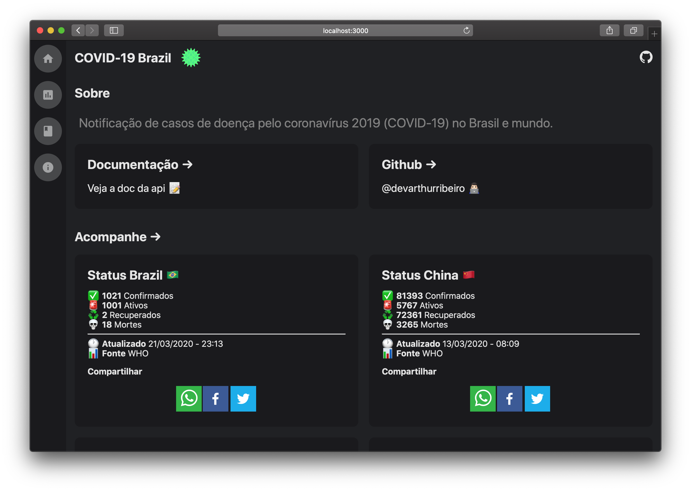

<p align="center">
  
</p>
<h1 align="center">COVID-19 Brazil API</h1>
<p align="center">
  <strong>Notificação de casos de doença pelo coronavírus 2019 (COVID-19) no Brasil</strong>
</p>

[English version](./README-US.md) 🇺🇸

<div align="center">
  <br>
    
  <br>
</div>

## Motivo 🤔

Fornecer uma API JSON com dados atualizados sobre o avanço do coronavírus no Brasil, assim como em outros países.

## Datasets 💽

- [CSSEGISandData](https://github.com/CSSEGISandData/COVID-19)
- [Ministério da Saúde](http://plataforma.saude.gov.br/novocoronavirus)

## Showcase 🎯
- [COVID19 Tracker](https://apex.oracle.com/pls/apex/f?p=82495)
- [APP COVID-19 Estatísticas 📱](https://github.com/robsonsilv4/covid19_statistics)
- [SITE sitecovid19](https://sitecovid19.netlify.com/)

## Servidor de desenvolvimento 🚀

Clonando o projeto:

```
git clone https://github.com/devarthurribeiro/covid19-brazil-api.git
```

Navegando até a pasta do projeto:

```
cd covid19-brazil-api/api
```

Baixando as dependências do projeto

```bash
yarn
```

Rodando o projeto

```bash
yarn dev
```

Visite [http://localhost:3000](http://localhost:3000) com o seu navegador para ver o resultado.

## Docs 📄

- [Site](https://covid19-brazil-api-docs.now.sh/)


## Base url 🔌

Todas chamadas devem usar a url base:
```
https://covid19-brazil-api.now.sh
```

## License 📝

This project is licensed under the [MIT License](https://opensource.org/licenses/MIT) - see the [LICENSE](LICENSE) file for details.

## Contribuidores

<table>
  <tr>
    <td align="center"><a href="https://github.com/Lukazovic"><br /><sub><b>Lucas Vieira</b></sub></a><br /><a href="https://github.com/devarthurribeiro/covid19-brazil-api/commits?author=Lukazovic" title="Code">💻</a></a></td>
  <tr>
</table>

## Autor

<table>
  <tr>
    <td align="center"><a href="https://github.com/devarthurribeiro"><br /><sub><b>Arthur Ribeiro</b></sub></a><br /><a href="https://github.com/devarthurribeiro/covid19-brazil-api/commits?author=devarthurribeiro" title="Code">💻</a> <a href="#devarthurribeiro" title="Design">🎨</a></td>
  <tr>
</table>
